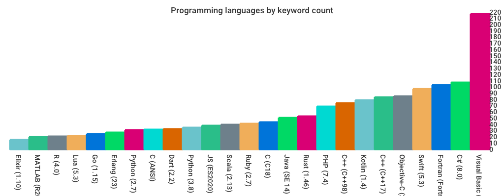

# Keywords

A list and count of keywords in programming languages. Based on work originally
compiled by [@leighmcculloch](https://github.com/leighmcculloch) and contributors.

## Why does it matter?

The number of keywords in a programming language _can_ be an indication to it's simplicity/complexity, and that can impact the simplicity/complexity of the solutions that developers produce using it. Complex solutions can be more expensive to maintain and difficult to hire for. However, this is dependent on many factors and keyword count is only one; language idioms also play a massive part.

## Contribute

Don't see a language here? Please open a pull request adding it!

## Keyword List

* [C (ANSI) (32 keywords)](#c-ansi-32-keywords)
* [C (C18) (44 keywords)](#c-c18-44-keywords)
* [C# (5.0) (77 keywords)](#c-50-77-keywords)
* [C++ (C++17) (73 keywords)](#c-c-17-73-keywords)
* [Dart (1) (33 keywords)](#dart-1-33-keywords)
* [Elixir (1.7) (15 keywords)](#elixir-17-15-keywords)
* [Erlang (21.2) (27 keywords)](#erlang-212-27-keywords)
* [Go (1.11) (25 keywords)](#go-111-25-keywords)
* [JS (ES2018) (34 keywords)](#js-es2018-34-keywords)
* [Java (SE 11) (51 keywords)](#java-se-11-51-keywords)
* [Kotlin (1.3) (30 keywords)](#kotlin-13-30-keywords)
* [Lua (5.3) (22 keywords)](#lua-53-22-keywords)
* [PHP (7.0) (67 keywords)](#php-70-67-keywords)
* [Python (2.7) (31 keywords)](#python-27-31-keywords)
* [Python (3.7) (35 keywords)](#python-37-35-keywords)
* [R (3.5) (20 keywords)](#r-35-20-keywords)
* [Ruby (2.5) (41 keywords)](#ruby-25-41-keywords)
* [Rust (1.31) (53 keywords)](#rust-131-53-keywords)
* [Scala (2.12) (40 keywords)](#scala-212-40-keywords)
* [Swift (4.2) (70 keywords)](#swift-42-70-keywords)

### C (ANSI) (32 keywords)
| | | | |
|---|---|---|---|
|  auto | break | case | char |
|  const | continue | default | do |
|  double | else | enum | extern |
|  float | for | goto | if |
|  int | long | register | return |
|  short | signed | sizeof | static |
|  struct | switch | typedef | union |
|  unsigned | void | volatile | while |

#### Sources:

[http://port70.net/~nsz/c/c89/c89-draft.html#3.1.1](http://port70.net/~nsz/c/c89/c89-draft.html#3.1.1)
### C (C18) (44 keywords)
| | | | |
|---|---|---|---|
|  auto | break | case | char |
|  const | continue | default | do |
|  double | else | enum | extern |
|  float | for | goto | if |
|  inline | int | long | register |
|  restrict | return | short | signed |
|  sizeof | static | struct | switch |
|  typedef | union | unsigned | void |
|  volatile | while | _Alignas | _Alignof |
|  _Atomic | _Bool | _Complex | _Generic |
|  _Imaginary | _Noreturn | _Static_assert | _Thread_local |

#### Sources:

[http://www.open-std.org/jtc1/sc22/wg14/www/abq/c17_updated_proposed_fdis.pdf](http://www.open-std.org/jtc1/sc22/wg14/www/abq/c17_updated_proposed_fdis.pdf)
### C# (5.0) (77 keywords)
| | | | |
|---|---|---|---|
|  abstract | as | base | bool |
|  break | byte | case | catch |
|  char | checked | class | const |
|  continue | decimal | default | delegate |
|  do | double | else | enum |
|  event | explicit | extern | false |
|  finally | fixed | float | for |
|  foreach | goto | if | implicit |
|  in | int | interface | internal |
|  is | lock | long | namespace |
|  new | null | object | operator |
|  out | override | params | private |
|  protected | public | readonly | ref |
|  return | sbyte | sealed | short |
|  sizeof | stackalloc | static | string |
|  struct | switch | this | throw |
|  true | try | typeof | uint |
|  ulong | unchecked | unsafe | ushort |
|  using | virtual | void | volatile |
|  while |

#### Sources:

[https://download.microsoft.com/download/0/B/D/0BDA894F-2CCD-4C2C-B5A7-4EB1171962E5/CSharp%20Language%20Specification.docx](https://download.microsoft.com/download/0/B/D/0BDA894F-2CCD-4C2C-B5A7-4EB1171962E5/CSharp%20Language%20Specification.docx)
### C++ (C++17) (73 keywords)
| | | | |
|---|---|---|---|
|  alignas | alignof | asm | auto |
|  bool | break | case | catch |
|  char | char16_t | char32_t | class |
|  const | constexpr | const_cast | continue |
|  decltype | default | delete | do |
|  double | dynamic_cast | else | enum |
|  explicit | export | extern | false |
|  float | for | friend | goto |
|  if | inline | int | long |
|  mutable | namespace | new | noexcept |
|  nullptr | operator | private | protected |
|  public | register | reinterpret_cast | return |
|  short | signed | sizeof | static |
|  static_assert | static_cast | struct | switch |
|  template | this | thread_local | throw |
|  true | try | typedef | typeid |
|  typename | union | unsigned | using |
|  virtual | void | volatile | wchar_t |
|  while |

#### Sources:

[http://www.open-std.org/jtc1/sc22/wg21/docs/papers/2017/n4659.pdf](http://www.open-std.org/jtc1/sc22/wg21/docs/papers/2017/n4659.pdf)
### Dart (1) (33 keywords)
| | | | |
|---|---|---|---|
|  assert | break | case | catch |
|  class | const | continue | default |
|  do | else | enum | extends |
|  false | final | finally | for |
|  if | in | is | new |
|  null | rethrow | return | super |
|  switch | this | throw | true |
|  try | var | void | while |
|  with |

#### Sources:

[http://www.ecma-international.org/publications/files/ECMA-ST/ECMA-408.pdf](http://www.ecma-international.org/publications/files/ECMA-ST/ECMA-408.pdf)
### Elixir (1.7) (15 keywords)
| | | | |
|---|---|---|---|
|  true | false | nil | when |
|  and | or | not | in |
|  fn | do | end | catch |
|  rescue | after | else |

#### Sources:

[https://github.com/elixir-lang/elixir/blob/master/lib/elixir/pages/Syntax%20Reference.md](https://github.com/elixir-lang/elixir/blob/master/lib/elixir/pages/Syntax%20Reference.md)
### Erlang (21.2) (27 keywords)
| | | | |
|---|---|---|---|
|  after | and | andalso | band |
|  begin | bnot | bor | bsl |
|  bsr | bxor | case | catch |
|  cond | div | end | fun |
|  if | let | not | of |
|  or | orelse | receive | rem |
|  try | when | xor |

#### Sources:

[http://erlang.org/doc/reference_manual/introduction.html#reserved-words](http://erlang.org/doc/reference_manual/introduction.html#reserved-words)
### Go (1.11) (25 keywords)
| | | | |
|---|---|---|---|
|  break | case | chan | const |
|  continue | default | defer | else |
|  fallthrough | for | func | go |
|  goto | if | import | interface |
|  map | package | range | return |
|  select | struct | switch | type |
|  var |

#### Sources:

[https://golang.org/ref/spec#Keywords](https://golang.org/ref/spec#Keywords)
### JS (ES2018) (34 keywords)
| | | | |
|---|---|---|---|
|  await | break | case | catch |
|  class | const | continue | debugger |
|  default | delete | do | else |
|  export | extends | finally | for |
|  function | if | import | in |
|  instanceof | new | return | super |
|  switch | this | throw | try |
|  typeof | var | void | while |
|  with | yield |

#### Sources:

[https://www.ecma-international.org/ecma-262/9.0/index.html#sec-keywords](https://www.ecma-international.org/ecma-262/9.0/index.html#sec-keywords)
### Java (SE 11) (51 keywords)
| | | | |
|---|---|---|---|
|  abstract | assert | boolean | break |
|  byte | case | catch | char |
|  class | const | continue | default |
|  do | double | else | enum |
|  extends | final | finally | float |
|  for | if | goto | implements |
|  import | instanceof | int | interface |
|  long | native | new | package |
|  private | protected | public | return |
|  short | static | strictfp | super |
|  switch | synchronized | this | throw |
|  throws | transient | try | void |
|  volatile | while | _ |

#### Sources:

[https://docs.oracle.com/javase/specs/jls/se11/html/jls-3.html#jls-3.9](https://docs.oracle.com/javase/specs/jls/se11/html/jls-3.html#jls-3.9)
### Kotlin (1.3) (30 keywords)
| | | | |
|---|---|---|---|
|  as | as? | break | class |
|  continue | do | else | false |
|  for | fun | if | in |
|   | interface | is |  |
|  null | object | package | return |
|  super | this | throw | true |
|  try | typealias | val | var |
|  when | while |

#### Sources:

[https://kotlinlang.org/docs/reference/keyword-reference.html](https://kotlinlang.org/docs/reference/keyword-reference.html)
### Lua (5.3) (22 keywords)
| | | | |
|---|---|---|---|
|  and | break | do | else |
|  elseif | end | false | for |
|  function | goto | if | in |
|  local | nil | not | or |
|  repeat | return | then | true |
|  until | while |

#### Sources:

[https://www.lua.org/manual/5.3/manual.html#3.1](https://www.lua.org/manual/5.3/manual.html#3.1)
### PHP (7.0) (67 keywords)
| | | | |
|---|---|---|---|
|  __halt_compiler() | abstract | and | array() |
|  as | break | callable | case |
|  catch | class | clone | const |
|  continue | declare | default | die() |
|  do | echo | else | elseif |
|  empty() | enddeclare | endfor | endforeach |
|  endif | endswitch | endwhile | eval() |
|  exit() | extends | final | finally |
|  for | foreach | function | global |
|  goto | if | implements | include |
|  include_once | instanceof | insteadof | interface |
|  isset() | list() | namespace | new |
|  or | print | private | protected |
|  public | require | require_once | return |
|  static | switch | throw | trait |
|  try | unset() | use | var |
|  while | xor | yield |

#### Sources:

[http://php.net/manual/en/reserved.keywords.php](http://php.net/manual/en/reserved.keywords.php)
### Python (2.7) (31 keywords)
| | | | |
|---|---|---|---|
|  and | as | assert | break |
|  class | continue | def | del |
|  elif | else | except | exec |
|  finally | for | from | global |
|  if | import | in | is |
|  lambda | not | or | pass |
|  print | raise | return | try |
|  while | with | yield |

#### Sources:

[https://docs.python.org/2/reference/lexical_analysis.html#keywords](https://docs.python.org/2/reference/lexical_analysis.html#keywords)
### Python (3.7) (35 keywords)
| | | | |
|---|---|---|---|
|  False | None | True | and |
|  as | assert | async | await |
|  break | class | continue | def |
|  del | elif | else | except |
|  finally | for | from | global |
|  if | import | in | is |
|  lambda | nonlocal | not | or |
|  pass | raise | return | try |
|  while | with | yield |

#### Sources:

[https://docs.python.org/3.7/reference/lexical_analysis.html#keywords](https://docs.python.org/3.7/reference/lexical_analysis.html#keywords)
### R (3.5) (20 keywords)
| | | | |
|---|---|---|---|
|  ... | FALSE | Inf | NA |
|  NA_character_ | NA_complex_ | NA_integer_ | NA_real_ |
|  NaN | NULL | TRUE | break |
|  else | for | function | if |
|  in | next | repeat | while |

#### Sources:

[https://cran.r-project.org/doc/manuals/r-release/R-lang.html#Reserved-words](https://cran.r-project.org/doc/manuals/r-release/R-lang.html#Reserved-words)
### Ruby (2.5) (41 keywords)
| | | | |
|---|---|---|---|
|  _ENCODING_ | _LINE_ | _FILE_ | BEGIN |
|  END | alias | and | begin |
|  break | case | class | def |
|  defined? | do | else | elsif |
|  end | ensure | false | for |
|  if | in | module | next |
|  nil | not | or | redo |
|  rescue | retry | return | self |
|  super | then | true | undef |
|  unless | until | when | while |
|  yield |

#### Sources:

[https://docs.ruby-lang.org/en/2.5.0/keywords_rdoc.html](https://docs.ruby-lang.org/en/2.5.0/keywords_rdoc.html)
### Rust (1.31) (53 keywords)
| | | | |
|---|---|---|---|
|  _ | abstract | alignof | as |
|  become | box | break | const |
|  continue | crate | do | else |
|  enum | extern | false | final |
|  fn | for | if | impl |
|  in | let | loop | macro |
|  match | mod | move | mut |
|  offsetof | override | priv | proc |
|  pub | pure | ref | return |
|  Self | self | sizeof | static |
|  struct | super | trait | true |
|  type | typeof | unsafe | unsized |
|  use | virtual | where | while |
|  yield |

#### Sources:

[https://doc.rust-lang.org/grammar.html#keywords](https://doc.rust-lang.org/grammar.html#keywords)
### Scala (2.12) (40 keywords)
| | | | |
|---|---|---|---|
|  abstract | case | catch | class |
|  def | do | else | extends |
|  false | final | finally | for |
|  forSome | if | implicit | import |
|  lazy | macro | match | new |
|  null | object | override | package |
|  private | protected | return | sealed |
|  super | this | throw | trait |
|  try | true | type | val |
|  var | while | with | yield |

#### Sources:

[https://scala-lang.org/files/archive/spec/2.12/01-lexical-syntax.html](https://scala-lang.org/files/archive/spec/2.12/01-lexical-syntax.html)
### Swift (4.2) (70 keywords)
| | | | |
|---|---|---|---|
|  associatedtype | class | deinit | enum |
|  extension | fileprivate | func | import |
|  init | inout | internal | let |
|  open | operator | private | protocol |
|  public | static | struct | subscript |
|  typealias | var | break | case |
|  continue | default | defer | do |
|  else | fallthrough | for | guard |
|  if | in | repeat | return |
|  switch | where | while | as |
|  Any | catch | false | is |
|  nil | rethrows | super | self |
|  Self | throw | throws | true |
|  try | _ | #available | #colorLiteral |
|  #column | #else | #elseif | #endif |
|  #error | #file | #fileLiteral | #function |
|  #if | #imageLiteral | #line | #selector |
|  #sourceLocation | #warning |

#### Sources:

[https://docs.swift.org/swift-book/ReferenceManual/LexicalStructure.html](https://docs.swift.org/swift-book/ReferenceManual/LexicalStructure.html)

